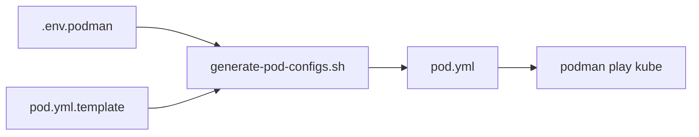

# 🚀 PORTABILITÉ DU PROJET SYMFONY MULTI-SITES

## 📋 Vue d'ensemble

Ce projet utilise une **architecture portable** basée sur des **templates** et des **variables d'environnement** pour garantir qu'il peut être déployé sur n'importe quelle machine sans modification du code.

## 🎯 Problème résolu

### ❌ Avant (Architecture non portable)
```yaml
# pods/node/pod.yml - HARDCODÉ
volumes:
  - name: symfony-code
    hostPath:
      path: /home/sam/Bureau/dev/production/smfn_73_multi  # ❌ Chemin absolu en dur
      type: Directory
```

**Problèmes :**
- ❌ Impossible de déployer sur une autre machine
- ❌ Impossible de changer le chemin du projet
- ❌ Violation des règles de sécurité (pas de chemins hardcodés)
- ❌ Maintenance difficile (modifications multiples nécessaires)

### ✅ Après (Architecture portable)
```yaml
# pods/node/pod.yml.template - TEMPLATE
volumes:
  - name: symfony-code
    hostPath:
      path: ${PROJECT_ROOT}  # ✅ Variable d'environnement
      type: Directory
```

**Avantages :**
- ✅ Portable entre environnements
- ✅ Configuration centralisée dans `.env.podman`
- ✅ Respect des règles de sécurité
- ✅ Maintenance simplifiée

## 📁 Architecture des fichiers

```
smfn73-multi/
├── .env.podman.example          # Template de configuration (versionné)
├── .env.podman                  # Configuration locale (gitignored)
├── scripts/
│   └── generate-pod-configs.sh  # Script de génération
└── pods/
    ├── mariadb/
    │   ├── pod.yml.template     # Template (versionné)
    │   └── pod.yml              # Généré automatiquement (gitignored)
    ├── redis/
    │   ├── pod.yml.template
    │   └── pod.yml
    ├── web/
    │   ├── pod.yml.template
    │   └── pod.yml
    └── node/
        ├── pod.yml.template
        └── pod.yml
```

## 🔧 Configuration initiale

### 1. Créer le fichier `.env.podman`

```bash
# Copier le template
cp .env.podman.example .env.podman

# Éditer avec vos valeurs
nano .env.podman
```

### 2. Variables critiques à configurer

```bash
# ⚠️  OBLIGATOIRE : Chemin absolu du projet sur VOTRE machine
PROJECT_ROOT=/home/votre_utilisateur/chemin/vers/smfn73-multi

# Nom du projet (utilisé pour les pods)
PROJECT_NAME=symfony-multi

# Hôte
HOST=localhost

# Ports (ajustez si nécessaire)
APACHE_PORT=6900
MARIADB_PORT=6909
REDIS_PORT=6379
NODE_PORT=6904
```

### 3. Générer les configurations

```bash
# Génération manuelle
./scripts/generate-pod-configs.sh

# OU automatique lors de l'installation
./scripts/install-podman.sh

# OU automatique lors du démarrage
./scripts/symfony-orchestrator.sh dev
```

## 🔄 Workflow de génération



1. **Lecture** : Le script lit `.env.podman`
2. **Validation** : Vérifie que toutes les variables requises sont présentes
3. **Substitution** : Remplace les variables dans les templates
4. **Génération** : Crée les fichiers `pod.yml` finaux
5. **Déploiement** : Podman utilise les `pod.yml` générés

## 📝 Variables disponibles

### Variables système
- `PROJECT_ROOT` : Chemin absolu du projet
- `PROJECT_NAME` : Nom du projet (préfixe des pods)
- `HOST` : Hôte (localhost ou IP)
- `TZ` : Timezone (Europe/Paris par défaut)

### Variables réseau
- `APACHE_PORT` : Port Apache (6900)
- `MARIADB_PORT` : Port MariaDB (6909)
- `REDIS_PORT` : Port Redis (6379)
- `NODE_PORT` : Port Node.js (6904)
- `PHPMYADMIN_PORT` : Port PHPMyAdmin (6908)

### Variables base de données
- `DB_USER` : Utilisateur MySQL
- `DB_PASSWORD` : Mot de passe MySQL
- `DB_ROOT_PASSWORD` : Mot de passe root MySQL
- `DB_SLNS_NAME` : Nom base Silenus
- `DB_NSDM_NAME` : Nom base Insidiome

### Variables Symfony
- `APP_ENV` : Environnement (dev/prod)
- `APP_SECRET` : Clé secrète Symfony
- `DATABASE_SLNS_URL` : URL connexion Silenus
- `DATABASE_NSDM_URL` : URL connexion Insidiome
- `REDIS_URL` : URL connexion Redis

### Variables images
- `IMAGE_PHP` : Image PHP-FPM
- `IMAGE_APACHE` : Image Apache
- `IMAGE_MARIADB` : Image MariaDB
- `IMAGE_REDIS` : Image Redis
- `IMAGE_NODE` : Image Node.js
- `IMAGE_COMPOSER` : Image Composer
- `IMAGE_PHPMYADMIN` : Image PHPMyAdmin

## 🚀 Déploiement sur une nouvelle machine

### Étape 1 : Cloner le projet
```bash
git clone <repository> /chemin/vers/nouveau/projet
cd /chemin/vers/nouveau/projet
```

### Étape 2 : Configurer l'environnement
```bash
# Copier le template
cp .env.podman.example .env.podman

# Éditer avec le NOUVEAU chemin
nano .env.podman
```

**Modifier uniquement :**
```bash
PROJECT_ROOT=/chemin/vers/nouveau/projet  # ⚠️ Nouveau chemin absolu
```

### Étape 3 : Installer
```bash
./scripts/install-podman.sh
```

**C'est tout !** Le projet est maintenant configuré pour votre machine.

## 🔍 Vérification de la portabilité

### Tester sur un autre chemin
```bash
# Copier le projet ailleurs
cp -r /home/sam/Bureau/DEV/smfn73-multi /tmp/test-portability
cd /tmp/test-portability

# Reconfigurer
cp .env.podman.example .env.podman
sed -i 's|PROJECT_ROOT=.*|PROJECT_ROOT=/tmp/test-portability|' .env.podman

# Générer et tester
./scripts/generate-pod-configs.sh
./scripts/symfony-orchestrator.sh dev
```

### Vérifier les chemins générés
```bash
# Vérifier que les chemins sont corrects
grep -r "PROJECT_ROOT" pods/*/pod.yml
# Ne devrait retourner AUCUN résultat (les variables sont remplacées)

grep -r "/home/sam" pods/*/pod.yml
# Ne devrait retourner AUCUN résultat (pas de chemins hardcodés)
```

## 🛠️ Maintenance

### Ajouter une nouvelle variable

1. **Ajouter dans `.env.podman.example`**
```bash
# Nouvelle variable
MY_NEW_VAR=valeur_par_defaut
```

2. **Utiliser dans les templates**
```yaml
# pods/service/pod.yml.template
env:
  - name: MY_VAR
    value: "${MY_NEW_VAR}"
```

3. **Régénérer**
```bash
./scripts/generate-pod-configs.sh
```

### Ajouter un nouveau service

1. **Créer le template**
```bash
# pods/nouveau-service/pod.yml.template
apiVersion: v1
kind: Pod
metadata:
  name: ${PROJECT_NAME}-nouveau-service-pod
spec:
  containers:
  - name: ${PROJECT_NAME}-nouveau-service
    image: ${IMAGE_NOUVEAU_SERVICE}
    # ...
```

2. **Ajouter au script de génération**
```bash
# scripts/generate-pod-configs.sh
SERVICES=(
    "mariadb"
    "redis"
    "web"
    "node"
    "phpmyadmin"
    "nouveau-service"  # Ajouter ici
)
```

3. **Régénérer**
```bash
./scripts/generate-pod-configs.sh
```

## ⚠️ Règles de sécurité

### ✅ OBLIGATOIRE
- **TOUJOURS** utiliser des variables d'environnement pour les chemins
- **TOUJOURS** utiliser des templates `.yml.template`
- **JAMAIS** versionner les fichiers `.env.podman` ou `pod.yml`
- **TOUJOURS** versionner les fichiers `.env.podman.example` et `pod.yml.template`

### ❌ INTERDIT
- Chemins absolus hardcodés dans les templates
- Mots de passe en clair dans les templates
- IPs ou ports hardcodés (sauf valeurs par défaut dans .example)
- Modifications directes des fichiers `pod.yml` (ils sont régénérés)

## 🐛 Dépannage

### Les pods ne démarrent pas
```bash
# Vérifier les configurations générées
cat pods/mariadb/pod.yml
cat pods/web/pod.yml

# Vérifier les variables
cat .env.podman | grep PROJECT_ROOT
```

### Chemins incorrects
```bash
# Régénérer les configurations
./scripts/generate-pod-configs.sh

# Vérifier le résultat
grep "path:" pods/*/pod.yml
```

### Variables manquantes
```bash
# Le script affichera les variables manquantes
./scripts/generate-pod-configs.sh
```

## 📚 Références

- [Installation Podman](INSTALLATION_PODMAN.md)
- [Utilisation Podman](../PODMAN_USAGE.md)
- [Architecture dagda-lite](../../dagda-lite/docs/ARCHITECTURE.md)

---

**✅ Avec cette architecture, le projet est maintenant 100% portable !**
